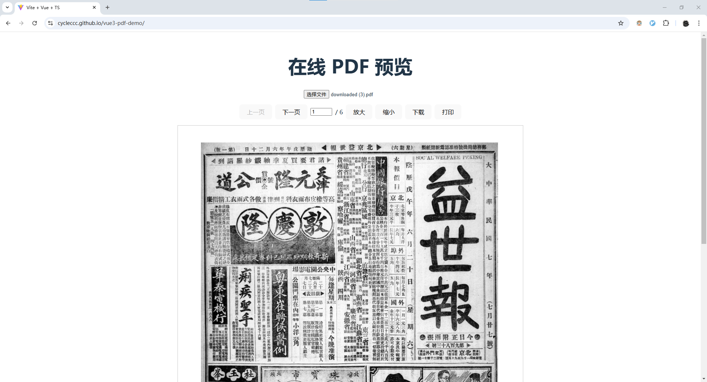

# 运行截图

# 如何使用

- 安装
~~~shell
pnpm install
~~~

- 启动测试环境
~~~shell
pnpm run dev
~~~

- 打包发布
~~~shell
pnpm run build
pnpm run deploy
~~~

# 软件设计说明书

## 1. 项目概述

该项目是一个基于 **Vue 3** 和 **Vite** 的 **PDF 预览应用**。用户可以上传 PDF 文件，并在浏览器中实时查看 PDF 内容，支持翻页、缩放、下载、打印等功能。该应用使用 `pdfjs-dist` 库进行 PDF 渲染，具有简洁直观的 UI 和交互。

## 2. 目标与功能

### 2.1 目标

开发一个基于 Vue 3 和 Vite 的前端应用，提供以下功能：

- 上传 PDF 文件并进行预览。
- 支持 PDF 文件的翻页、缩放功能。
- 支持打印和下载 PDF 文件。

### 2.2 功能需求

1. **文件上传功能**：
   - 用户能够上传本地 PDF 文件。
   - 通过 `<input type="file">` 组件实现文件选择功能。

2. **PDF 渲染**：
   - 使用 `pdfjs-dist` 库渲染 PDF 文件。
   - 将 PDF 内容绘制到 HTML `<canvas>` 元素中。

3. **翻页功能**：
   - 用户可以通过点击“上一页”和“下一页”按钮切换 PDF 页面。
   - 用户可以通过输入页码并按回车键跳转到指定页面。

4. **缩放功能**：
   - 用户可以通过点击“放大”和“缩小”按钮调整 PDF 页面大小。
   - 页面缩放时保持内容清晰。

5. **下载功能**：
   - 用户能够下载当前显示的 PDF 文件。

6. **打印功能**：
   - 用户能够将 PDF 文件发送到打印机进行打印。

---

## 3. 系统架构

该项目采用前端单页面应用（SPA）架构，基于 Vue 3 和 Vite 进行开发。所有操作（如文件上传、页面渲染、交互）都通过客户端完成，无需服务器端支持。

### 3.1 前端框架与技术栈

- **Vue 3**：前端框架，基于 Vue Composition API 构建组件和逻辑。
- **Vite**：前端构建工具，快速启动开发环境。
- **pdfjs-dist**：用于 PDF 文件渲染的第三方库，负责将 PDF 渲染到 `<canvas>` 上。
- **HTML/CSS**：基础的网页结构和样式。

---

## 4. 详细设计

### 4.1 组件设计

项目包含以下主要组件：

1. **PdfViewer.vue**：
   - 用于展示 PDF 文件内容和处理所有交互功能。
   - 主要包含上传文件、控制栏（翻页、缩放）、PDF 渲染区域。

2. **控制栏**：
   - 包含按钮和输入框，用户可以操作翻页、缩放以及跳转到指定页面。

3. **Canvas 区域**：
   - 使用 `<canvas>` 元素来渲染 PDF 页面。
   - 每次用户翻页或缩放时，更新 `<canvas>` 渲染的内容。

### 4.2 数据流设计

1. **文件加载**：
   - 用户选择文件后，使用 `FileReader` 读取 PDF 文件内容。
   - 使用 `pdfjsLib.getDocument()` 加载 PDF 文件。

2. **页面渲染**：
   - 获取 PDF 文件的页数。
   - 根据当前页码渲染 PDF 页面到 `<canvas>` 上。

3. **翻页与缩放**：
   - 用户点击翻页按钮时，更新当前页码，并重新渲染该页。
   - 缩放时，调整 `scale` 值并重新渲染当前页。

4. **打印与下载**：
   - 使用浏览器的内建打印功能 (`window.print()`) 打印当前页。
   - 使用 `FileSaver.js`（或浏览器默认下载功能）实现文件下载功能。

### 4.3 样式设计

1. **PDF 显示区域**：
   - 使用 `canvas` 元素渲染 PDF 页面，保证 PDF 页面在不同分辨率下显示清晰。
   - 控制区域位于页面上方，保持布局整洁。
   
2. **控制栏**：
   - 按钮使用标准样式，并确保具有响应式设计，在不同屏幕尺寸下良好显示。
   - 页码输入框和总页数显示在同一行，确保操作简便。

---

## 5. 接口设计

### 5.1 文件上传接口

- **接口描述**：通过文件输入框上传 PDF 文件。
- **输入参数**：用户选择的 PDF 文件。
- **输出参数**：读取到的 PDF 文件数据。
- **处理逻辑**：
  - 使用 `FileReader` 读取文件内容。
  - 使用 `pdfjsLib` 加载文件并渲染。

### 5.2 渲染页面接口

- **接口描述**：通过 `pdfjsLib.getPage()` 获取并渲染指定页码的 PDF 页面。
- **输入参数**：当前页码、缩放比例。
- **输出参数**：渲染的 Canvas 图形。
- **处理逻辑**：
  - 调用 `getPage()` 获取 PDF 页面的数据。
  - 使用 `canvas.getContext('2d')` 渲染到 Canvas 元素上。

---

## 6. 测试计划

### 6.1 功能测试

- 测试 PDF 文件能否正确上传、读取和渲染。
- 测试翻页、缩放、跳转到指定页面功能是否有效。
- 测试文件下载和打印功能是否按预期工作。

### 6.2 兼容性测试

- 测试该应用在不同浏览器（Chrome、Firefox、Edge）和操作系统（Windows、Mac、Linux）上的兼容性。

### 6.3 性能测试

- 测试在大文件（如超过 100MB 的 PDF 文件）下应用的性能表现。

---

## 7. 安全与隐私

- 上传的 PDF 文件将仅在前端处理，不会上传到服务器。
- 不收集任何用户的敏感数据。

---

## 8. 部署与维护

### 8.1 部署方式

- 该应用将通过 GitHub Pages 部署，以静态网页形式提供访问。

### 8.2 维护计划

- 定期检查依赖库（如 `pdfjs-dist`）的版本更新，并进行必要的升级。
- 根据用户反馈进行 UI/UX 的改进。

---

## 9. 版本控制

| 版本 | 修改日期  | 备注           |
| ---- | --------- | -------------- |
| 1.0  | 2024-12-04 | 初始版本发布   |
